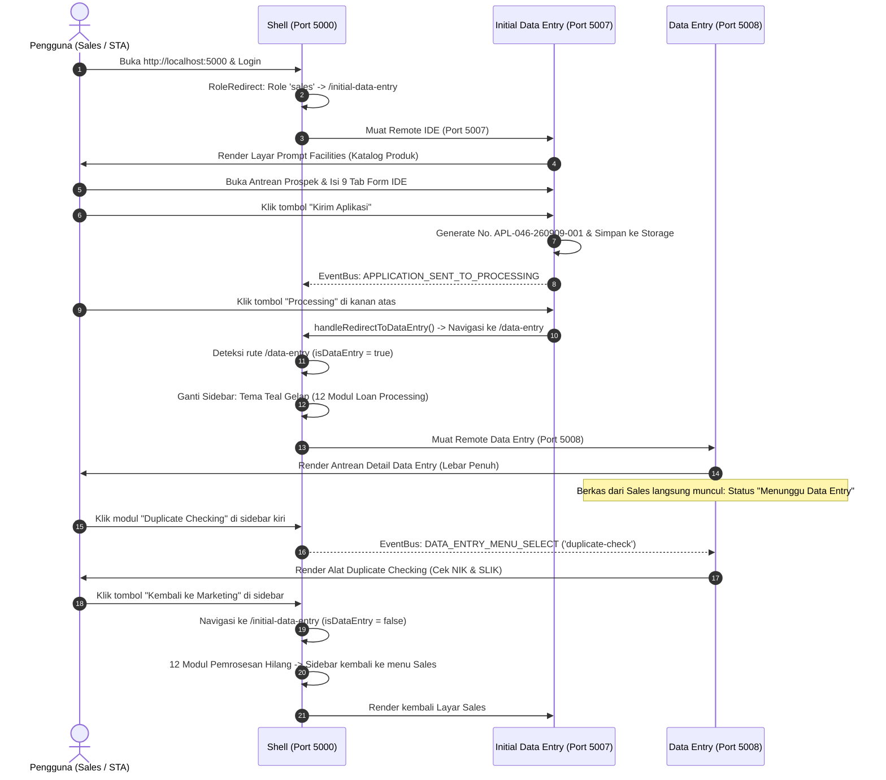

# 📘 SUMMARY DOKUMENTASI ARSITEKTUR & ALUR KERJA
## BNI electronic Loan Origination (eLO) - Micro-Frontend System

---

## 📑 DAFTAR ISI
1. [Ringkasan Eksekutif (Executive Summary)](#1-ringkasan-eksekutif)
2. [Infrastruktur & Arsitektur Micro-Frontend](#2-infrastruktur--arsitektur-micro-frontend)
   - [Peta Server & Port](#peta-server--port)
   - [Konsep Webpack 5 Module Federation](#konsep-webpack-5-module-federation)
   - [Pola Shared Singleton](#pola-shared-singleton)
3. [Struktur Modul & Tanggung Jawab Folder](#3-struktur-modul--tanggung-jawab-folder)
   - [shell (Host / Container)](#-a-shell-port-5000---host-container)
   - [initial-data-entry (Remote Sales / IDE)](#-b-initial-data-entry-port-5007---marketing--ide)
   - [data-entry (Remote Loan Processing / DE)](#-c-data-entry-port-5008---loan-processing--de)
   - [spv-ca (Remote Supervisor Credit Admin)](#-d-spv-ca-port-5006---supervisor-credit-admin)
   - [shared (Internal Shared Library)](#-e-shared---internal-shared-library)
4. [Mekanisme Komunikasi Antar-MFE](#4-mekanisme-komunikasi-antar-mfe)
   - [Pola Walkie-Talkie (EventBus)](#a-pola-walkie-talkie-eventbus)
   - [Sinkronisasi Penyimpanan (Storage Sync)](#b-sinkronisasi-penyimpanan-storage-sync)
   - [Sinkronisasi Navigasi URL (Query Params)](#c-sinkronisasi-navigasi-url-query-params)
5. [Alur Kerja Lengkap Sistem (End-to-End Flow)](#5-alur-kerja-lengkap-sistem-end-to-end-flow)
   - [Alur 1: Autentikasi & RBAC](#alur-1-autentikasi--role-based-redirection)
   - [Alur 2: Sales Input Form 9 Tab IDE](#alur-2-sales-input-form-9-tab-ide)
   - [Alur 3: Pengiriman Berkas dari Sales ke Processing](#alur-3-pengiriman-berkas-dari-sales-ke-processing)
   - [Alur 4: Transisi Menuju Modul Processing](#alur-4-transisi-menuju-modul-processing)
   - [Alur 5: Transformasi Sidebar Dinamis Shell](#alur-5-transformasi-sidebar-dinamis-shell)
   - [Alur 6: Pemrosesan Kredit di Data Entry](#alur-6-pemrosesan-kredit-di-data-entry)
   - [Alur 7: Transisi Kembali ke Marketing](#alur-7-transisi-kembali-ke-marketing)
6. [Tabel Matriks Teknologi & Peralatan](#6-tabel-matriks-teknologi--peralatan)
7. [Panduan Operasional & Cheatsheet](#7-panduan-operasional--cheatsheet)

---

# 1. Ringkasan Eksekutif

Sistem ini adalah antarmuka web modern untuk **BNI electronic Loan Origination (eLO)** yang mengelola proses pengajuan dan pemrosesan kredit konsumer (*BNI Griya, BNI Oto, BNI Fleksi, dan BNI Multiguna*).

Alih-alih dibangun sebagai satu aplikasi monolitik raksasa (*Monolith*), sistem ini dirancang menggunakan paradigma **Micro-Frontend (MFE)**. Modul dibagi ke dalam beberapa aplikasi kecil independen (*Remotes*) yang berjalan di server dan port terpisah, lalu disatukan oleh sebuah aplikasi pembungkus utama (*Shell Host*) di memori peramban (*browser*) pengguna tanpa proses muat ulang halaman (*zero page reload / no postback*).

---

# 2. Infrastruktur & Arsitektur Micro-Frontend

### Peta Server & Port

```text
                               ┌────────────────────────────────────────────────────────┐
                               │                    BROWSER PENGGUNA                    │
                               │                http://localhost:5000                   │
                               └───────────────────────────┬────────────────────────────┘
                                                           │
                                                           ▼
┌────────────────────────────────────────────────────────────────────────────────────────────────────────────────────────┐
│                                                 PORT 5000: shell                                                       │
│  • Pintu Masuk, Autentikasi & RBAC (Login.tsx, AuthContext.tsx)                                                       │
│  • Cangkang Navigasi & Sidebar Dinamis Adaptif (Layout.tsx)                                                           │
│  • Pengatur Jalur Rute & Dynamic Remote Script Injector (routes.tsx, LazyMFE.tsx)                                     │
└───────────────────────────────┬────────────────────────────────────────────────────────┬───────────────────────────────┘
                                │                                                        │
                 Rute: /initial-data-entry/*                                    Rute: /data-entry/*
                                │                                                        │
                                ▼                                                        ▼
┌────────────────────────────────────────────────────────┐     ┌────────────────────────────────────────────────────────┐
│         PORT 5007: initial-data-entry                  │     │                PORT 5008: data-entry                   │
│               (Marketing / Sales)                      │     │                 (Loan Processing)                      │
│  • Landing Prompt Facilities (MainPrompt.tsx)          │     │  • Antrean Berkas Masuk dari Sales (DataEntryList.tsx) │
│  • Antrean Prospek Sales (InitialDataEntryList.tsx)    │     │  • 12 Modul Pemrosesan (DTBO, Duplicate Check, dll.)   │
│  • Formulir 9 Tab Resmi eLO (InitialDataEntry.tsx)     │     │  • Formulir Verifikasi Checklist (DataEntryForm.tsx)   │
└───────────────────────────────┬────────────────────────┘     └────────────────────────┬───────────────────────────────┘
                                │                                                        │
                                └───────────────────────────┬────────────────────────────┘
                                                            │
                                                            ▼
                               ┌────────────────────────────────────────────────────────┐
                               │                     FOLDER: shared                     │
                               │       (Pustaka Bersama Tanpa Port: @template/shared)   │
                               │  • Walkie-Talkie Komunikasi (eventBus.ts)              │
                               │  • Penyimpanan Sesi & Role Pengguna (AuthContext.tsx)  │
                               │  • Komponen UI Atomik, Format Uang, Token Warna BNI    │
                               └────────────────────────────────────────────────────────┘
```

### Konsep Webpack 5 Module Federation

1. **Host (`shell`)**: Bertindak sebagai konsumer. Pada `webpack.config.cjs`, Shell mendefinisikan dirinya sebagai container yang siap memuat remote script `remoteEntry.js` secara dinamis.
2. **Remotes (`initial-data-entry` & `data-entry`)**: Bertindak sebagai penyedia modul. Mereka mengekspos entry point:
   ```javascript
   exposes: {
     './Module': './src/Module.tsx'
   }
   ```
   Setiap remote menghasilkan artefak mini bernama `remoteEntry.js` di port masing-masing (`http://localhost:5007/remoteEntry.js` dan `http://localhost:5008/remoteEntry.js`).
3. **Pemuatan On-Demand (`LazyMFE.tsx`)**:
   Shell tidak mengunduh kode remote di awal. Saat rute `/data-entry` pertama kali dikunjungi, komponen `LazyMFE` menyuntikkan elemen `<script src="http://localhost:5008/remoteEntry.js">` ke dalam tag `<head>` HTML, mengambil modul via `window.dataEntryMFE.get('./Module')`, lalu merendernya ke layar.

### Pola Shared Singleton

Untuk mencegah terjadinya duplikasi library di memori browser (misalnya React terunduh dua kali yang dapat menyebabkan konflik hook):
```javascript
shared: {
  react: { singleton: true, eager: true },
  'react-dom': { singleton: true, eager: true },
  'react-router-dom': { singleton: true, eager: true }
}
```
Dengan konfigurasi ini, Shell dan seluruh Remote MFE berbagi **satu instance React dan React Router yang sama** di dalam memori browser.

---

# 3. Struktur Modul & Tanggung Jawab Folder

### 🏢 A. `shell` (Port 5000) - *Host Container*
* **Tanggung Jawab**: Manajemen sesi autentikasi, layout global, dan routing utama.
* **File Kunci**:
  * `src/routes/routes.tsx`: Memetakan rute URL ke MFE yang sesuai dan mengisolasi error dengan `MFEErrorBoundary`.
  * `src/components/Layout/Layout.tsx`: Mengelola **Sidebar Dinamis**. Mendeteksi `isDataEntry = location.pathname.startsWith('/data-entry')`. Jika berada di Processing, sidebar bertransformasi ke tema hijau gelap (`#004d40`) dengan 12 modul kredit. Jika keluar, kembali ke menu Sales.
  * `src/components/LazyMFE.tsx`: Menginjeksi dan merender remote MFE secara asinkron.
  * `src/pages/Login.tsx`: Antarmuka login multi-role (*Sales, Processing DE, SPV CA, Pemimpin, ADC*).

### 📝 B. `initial-data-entry` (Port 5007) - *Marketing / IDE*
* **Tanggung Jawab**: Domain Sales/STA untuk mencari nasabah, simulasi pembiayaan, dan input aplikasi kredit awal.
* **File Kunci**:
  * `src/Module.tsx`: Remote interface yang mengatur peralihan layar internal (`main`, `list`, `form`).
  * `src/pages/MainPrompt.tsx`: Layar **Prompt Facilities** katalog produk pembiayaan (Griya, Oto, Fleksi, Multiguna). Berisi tombol pintas **Processing** di pojok kanan atas.
  * `src/pages/InitialDataEntryList.tsx`: Antrean prospek sales, fitur pencarian debitur, dan tombol **"Kirim Aplikasi"**.
  * `src/pages/InitialDataEntry.tsx`: Formulir 9 Tab resmi (*Source, Agunan, Debitur, Pekerjaan, Pasangan, Pekerjaan Pasangan, Emergency, Rekening BNI, Memo SKDR*).

### ⚙️ C. `data-entry` (Port 5008) - *Loan Processing / DE*
* **Tanggung Jawab**: Domain back-office untuk verifikasi berkas, mitigasi risiko kredit, dan kelengkapan dokumen.
* **File Kunci**:
  * `src/Module.tsx`: Remote interface penentu tampilan antrean (`DataEntryList`) atau lembar verifikasi (`DataEntryForm`).
  * `src/pages/DataEntryList.tsx`: Workspace antrean lebar penuh (*full-width*) yang terhubung dengan 12 modul loan processing:
    1. *Detail Data Entry* (antrean utama berkas masuk)
    2. *Document To Be Obtained (DTBO Tracker)*
    3. *Duplicate Checking Tool* (pemeriksaan NIK ganda & SLIK Kolektibilitas)
    4. *Verification Assignment* (tugas survei lapangan, appraisal agunan, investigasi)
    5. *Scoring & Limit Setting Engine*
    6. *Perubahan SKDR*
    7. *Eform Griya Inbox*
    8. *Instan Approval*
    9. *Hasil Upload*
    10. *Send to Credit Admin (CAD)*
    11. *Upload Dokumen EDD*
  * `src/pages/DataEntryForm.tsx`: Formulir verifikasi dokumen checklist (*KTP, NPWP, Slip Gaji, Agunan*) dengan fitur *Return to Sales (RTS)* dan *Kirim ke SPV CA*.
  * `src/services/dataEntryData.ts`: Manajemen basis data lokal antrean kredit.

### 🛡️ D. `spv-ca` (Port 5006) - *Supervisor Credit Admin*
* **Tanggung Jawab**: Domain persetujuan penyelia (*supervisor*) dan delegasi berkas ke Analis Kredit (*CA*).

### 📦 E. `shared` - *Internal Shared Library*
* **Tanggung Jawab**: Pustaka utilitas atomik tanpa port yang diimpor oleh seluruh modul via alias `@template/shared`.
* **File Kunci**:
  * `src/lib/eventBus.ts`: Infrastruktur event pub/sub.
  * `src/contexts/AuthContext.tsx`: Konteks autentikasi global.
  * `src/lib/api.ts`: Klien HTTP dengan error handling terpusat.
  * `src/components/`: Tombol, input teks, modal dialog, spinner pemuatan.

---

# 4. Mekanisme Komunikasi Antar-MFE

Untuk menjaga prinsip *decoupling* (modul tidak boleh saling mengimpor file secara langsung), komunikasi dilakukan melalui 3 saluran:

```text
┌─────────────────────────────────────────────────────────────────────────────┐
│                          SALURAN KOMUNIKASI ANTAR-MFE                       │
├─────────────────────────────────────────────────────────────────────────────┤
│  1. EVENTBUS (Memori)       ──► eventBus.publish() & subscribe()             │
│  2. STORAGE SYNC (Disk)     ──► localStorage + window 'storage' listener    │
│  3. ROUTER SYNC (URL)       ──► navigate() + window 'popstate' listener     │
└─────────────────────────────────────────────────────────────────────────────┘
```

### A. Pola Walkie-Talkie (EventBus)
Diimplementasikan pada `shared/src/lib/eventBus.ts`.
- **Publisher (Pengirim)**: Menyiarkan event beserta data payload.
  ```typescript
  eventBus.publish('APPLICATION_SENT_TO_PROCESSING', newRecord);
  ```
- **Subscriber (Penerima)**: Mendaftarkan fungsi pendengar yang aktif di background.
  ```typescript
  const unsubscribe = eventBus.subscribe('APPLICATION_SENT_TO_PROCESSING', (record) => {
    refreshTableData();
  });
  ```

### B. Sinkronisasi Penyimpanan (Storage Sync)
Ketika berkas baru dikirim dari Sales, data disimpan pada `localStorage.setItem('bni_data_entry_applications', ...)`. Listener `window.addEventListener('storage', refreshData)` memastikan bahwa jika pengguna membuka aplikasi di dua tab atau jendela peramban berbeda, data seketika tersinkronisasi secara otomatis.

### C. Sinkronisasi Navigasi URL (Query Params)
Ketika modul di sidebar Shell diklik, Shell memperbarui URL browser menjadi `/data-entry?menu=duplicate-check` dan memancarkan event `DATA_ENTRY_MENU_SELECT`. MFE Data Entry membaca parameter URL ini dan segera merender tampilan sub-modul yang bersangkutan.

---

# 5. Alur Kerja Lengkap Sistem (End-to-End Flow)



### Rincian Tahapan Alur:

#### Alur 1: Autentikasi & Role-Based Redirection
1. Pengguna membuka `http://localhost:5000/login`.
2. Pengguna login menggunakan akun Sales (`SC70629` / nama `Surya Harjaya`).
3. Komponen `RoleRedirect` membaca role `sales` dan otomatis mengarahkan ke `/initial-data-entry`.

#### Alur 2: Sales Input Form 9 Tab IDE
1. Sales membuka katalog produk di `MainPrompt.tsx`.
2. Sales memilih produk (misal: BNI Griya) dan membuka form pengajuan di `InitialDataEntry.tsx`.
3. Sales mengisi data pada 9 tab formulir. Setiap perubahan tersimpan di state `formData` dan draft tersimpan di `localStorage` melalui fungsi `handleSaveDraft()`.

#### Alur 3: Pengiriman Berkas dari Sales ke Processing
1. Di halaman antrean prospek (`InitialDataEntryList.tsx`), Sales mengklik tombol **"Kirim Aplikasi"**.
2. Fungsi `handleKirimAplikasi(item)` membentuk nomor aplikasi resmi (contoh: `APL-046-260909-001`), status diubah menjadi `"Menunggu Data Entry"`, dan data dimasukkan ke key `bni_data_entry_applications`.
3. Event `APPLICATION_SENT_TO_PROCESSING` disiarkan melalui `eventBus`.

#### Alur 4: Transisi Menuju Modul Processing
1. Sales mengklik tombol teks **"Processing"** pada navigasi atas Prompt Facilities.
2. Fungsi `handleRedirectToDataEntry()` di `MainPrompt.tsx` menjalankan `navigate('/data-entry')`.
3. Karena library `react-router-dom` berstatus *singleton*, perintah navigasi dari MFE remote langsung menggerakkan router utama milik Shell.

#### Alur 5: Transformasi Sidebar Dinamis Shell
1. Pada `Layout.tsx` di Shell, hook `useLocation()` mendeteksi perubahan alamat menjadi `/data-entry`.
2. Variabel `isDataEntry` bernilai `true`.
3. Shell merender blok menu khusus Processing:
   - Warna latar belakang sidebar berganti menjadi warna teal perbankan (`bg-[#004d40]`).
   - Tombol **"Kembali ke Marketing"** dimunculkan di bagian atas.
   - Header **"Loan Processing (12 Modul)"** menampilkan seluruh daftar 12 modul pemrosesan kredit.

#### Alur 6: Pemrosesan Kredit di Data Entry
1. Shell memuat `data-entry/src/Module.tsx` via `LazyMFE`.
2. Halaman `DataEntryList.tsx` menerima data berkas yang dikirim tadi.
3. Petugas Processing mengklik berkas untuk membuka lembar checklist verifikasi dokumen di `DataEntryForm.tsx`.
4. Petugas dapat berpindah modul menggunakan sidebar kiri Shell (misalnya memeriksa riwayat fasilitas di *Duplicate Checking* atau memantau dokumen di *DTBO Tracker*).

#### Alur 7: Transisi Kembali ke Marketing
1. Petugas mengklik tombol **"Kembali ke Marketing"** di sidebar Shell.
2. Rute berpindah kembali ke `/initial-data-entry`.
3. `isDataEntry` seketika bernilai `false`.
4. Seluruh 12 menu Loan Processing otomatis dihilangkan dari DOM sidebar, dan sidebar Shell kembali menampilkan menu tunggal Sales: *Initial Data Entry (IDE)*.

---

# 6. Tabel Matriks Teknologi & Peralatan

| Komponen | Pilihan Teknologi | Peran & Alasan Penggunaan |
| :--- | :--- | :--- |
| **Package Manager** | `pnpm` Workspaces | Mengelola multi-paket secara efisien dengan hard-link memori disk. |
| **MFE Engine** | `Webpack 5 Module Federation` | Menghubungkan bundle JavaScript terpisah saat runtime tanpa build ulang host. |
| **UI Framework** | `React 18` + `TypeScript` | Antarmuka deklaratif dengan validasi tipe data statis ketat. |
| **Navigasi** | `react-router-dom` (v6) | Pengatur rute URL terintegrasi yang di-share sebagai singleton. |
| **Desain & CSS** | `Tailwind CSS` + `PostCSS` | Styling utility-first berbasis palet korporat BNI (Orange `#e65100`, Teal `#004d40`). |
| **Ikonografi** | `lucide-react` | Koleksi ikon antarmuka enterprise (*ShieldCheck, FileCheck2, Sliders*). |
| **Komunikasi** | In-Memory `EventBus` | Saluran pesan pub/sub antar MFE remote tanpa direct dependency. |
| **Runner Paralel** | `concurrently` | Menjalankan server dev port 5000, 5007, dan 5008 secara simultan. |

---

# 7. Panduan Operasional & Cheatsheet

### Menjalankan Seluruh Modul
Jalankan dari direktori root proyek:
```bash
pnpm dev
```
Perintah ini akan menyalakan 3 dev server sekaligus:
* `shell` di `http://localhost:5000`
* `initial-data-entry` di `http://localhost:5007`
* `data-entry` di `http://localhost:5008`

### Melakukan Pemeriksaan Tipe Data (Typecheck)
Untuk memastikan tidak ada kesalahan ketik kode di seluruh modul:
```bash
pnpm -r typecheck
```

### Menjalankan Modul Tertentu Saja
Jika Anda hanya ingin mengembangkan satu modul:
```bash
# Menjalankan Shell saja:
pnpm --filter @template/shell dev

# Menjalankan Sales IDE saja:
pnpm --filter @template/mfe-initial-data-entry dev

# Menjalankan Data Entry saja:
pnpm --filter @template/mfe-data-entry dev
```

### Akun Uji Coba Default
Pada halaman login (`http://localhost:5000/login`):
* **Sales / STA**: Username `SC70629` / password sembarang (otomatis login sebagai *Surya Harjaya - Cabang 046 Serang*).
* **Data Entry Officer**: Username `DE001` / password sembarang.
* **SPV CA**: Username `SPV001` / password sembarang.
